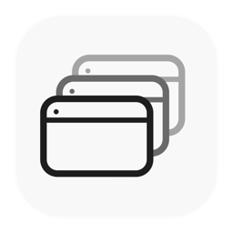
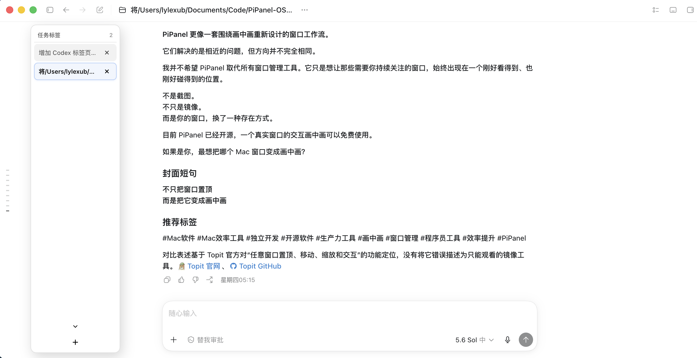
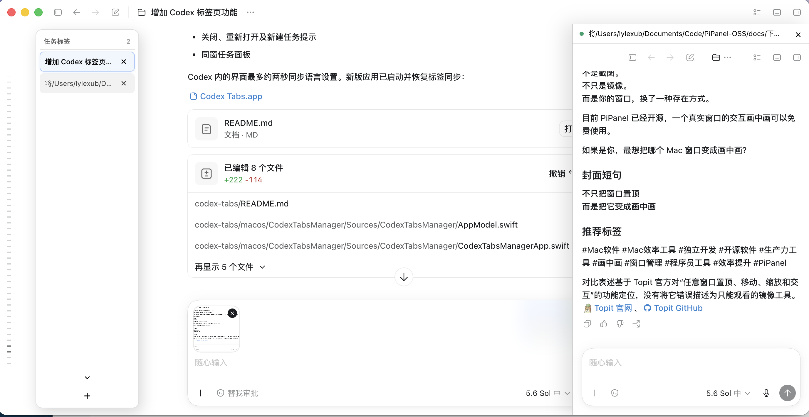
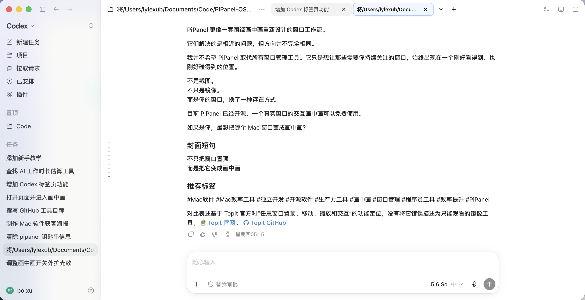

<div align="center">
  
  <h1>Codex Tabs</h1>
  <p><strong>为 macOS Codex 增加浏览器式标签、实时用量预览与同窗双开对话。</strong></p>
  <p>
    <a href="README.md">English</a> ·
    <a href="README.zh-CN.md">简体中文</a>
  </p>
  <p>
    <a href="https://github.com/Lyle-xub/codex-tabs/stargazers"></a>
    <a href="https://github.com/Lyle-xub/codex-tabs/releases/latest"></a>
    <a href="https://github.com/Lyle-xub/codex-tabs/releases"></a>
    
    
  </p>
</div>

Codex Tabs 是一个面向 macOS Codex 桌面端的小型运行时界面 Hack。它提供原生菜单栏管理器，并将 Codex 任务映射为横向或纵向标签，不修改 `Codex.app`、`app.asar` 或官方应用签名。

它通过只绑定 `127.0.0.1` 的随机 Chromium DevTools 端口连接 Codex，并注入可撤销的 JavaScript/CSS 界面层。只要 Codex 没有彻底替换任务 DOM 和前端协议，就可以通过更新适配器继续兼容，而不需要修改官方应用包。

## 界面预览

<table>
  <tr>
    <th width="33.33%">纵向侧边栏</th>
    <th width="33.33%">同窗双开对话</th>
    <th width="33.33%">顶部标签栏</th>
  </tr>
  <tr>
    <td></td>
    <td></td>
    <td></td>
  </tr>
</table>

> [!IMPORTANT]
> 这是一个非官方、实验性质的个人研究项目，与 OpenAI 无隶属或授权关系。请仅在自己有权控制的设备和 Codex 会话中使用。项目不绕过账号权限、订阅、额度或服务端安全机制。

## 我的破解思路

1. **只在本机启动或连接。** 启动器通过 bundle ID `com.openai.codex` 识别 Codex，选择空闲本地端口，通过 macOS LaunchServices 启动完整应用（或连接已经开放调试端口的实例），再通过 CDP 连接 Chromium renderer；不会再把 Codex 内部可执行文件作为子进程直接运行。
2. **注入可撤销的界面补丁。** 使用 `Runtime.evaluate` 执行 [`src/injected.js`](src/injected.js)，创建独立 DOM、样式、观察器和事件监听；调用 `destroy()` 即可完整移除，不会退出 Codex。
3. **复用原生任务导航。** 脚本从稳定的 `data-testid`、任务 ID、链接和 ARIA 语义中发现任务。点击自定义标签时实际激活 Codex 原生任务入口，因此路由、会话状态和权限仍由 Codex 管理。
4. **只持久化界面状态。** `MutationObserver` 负责同步页面变化，`localStorage` 只保存标签顺序、关闭状态、面板宽度和外观偏好。
5. **在本地读取用量。** [`src/usage.mjs`](src/usage.mjs) 只读取 `~/.codex/sessions` 与 `~/.codex/archived_sessions` 中对应 JSONL 文件的尾部，用于显示 Token、缓存输入、上下文、工作状态和额度快照，不上传对话内容。

同窗任务是实验性最强的部分：它在当前 renderer 内创建同源 iframe，加载第二套 Codex 前端并转发父页面 preload 消息，因此无需创建第二个 `BrowserWindow`。代价是它更依赖 Codex 当前的前端入口和消息协议。

## 功能

- 原生侧边栏展开时显示横向顶部任务标签
- 原生侧边栏折叠时自动切换为纵向任务面板
- 单击切换、关闭但不归档、恢复最近关闭标签及 `Control+Shift+T`
- 长按拖动排序、跟随鼠标的拖动虚影与边缘自动滚动
- `Control+1`～`Control+9` 切换任务，`Control+W` 关闭标签
- 持久保存标题、顺序、当前标签、关闭状态、面板尺寸和外观
- 自定义当前标签颜色、背景、描边、阴影、透明度、圆角和尺寸
- 悬浮显示任务状态、运行时长、当前步骤、Token、缓存输入、上下文和额度变化
- 原生侧边栏任务节点卸载后，纵向栏仍可同步本地用量
- 离开任务页面或目录预览遮挡时自动隐藏标签栏
- 在同一个 Codex renderer 内实验性双开实时对话
- 分屏宽度可拖动、自动记忆，双击恢复默认比例
- 菜单栏管理器与注入界面均支持中文和英文
- 原生 SwiftUI 菜单栏应用，不显示 Dock 图标
- `Control-C` 安全清理注入内容，不退出 Codex

## 安装

1. 从 [GitHub Releases](https://github.com/Lyle-xub/codex-tabs/releases/latest) 下载最新的 `Codex-Tabs-*-macOS.zip`。
2. 解压得到 `Codex Tabs.app`。
3. 首次启动前使用 `⌘Q` 正常退出 Codex。
4. Release 构建已使用 Developer ID 正式签名，但未经过 Apple 公证；首次启动请在 Finder 中右键应用，选择“打开”，再确认系统提示。
5. 点击菜单栏中的 Codex Tabs 图标，选择“启动 Codex Tabs”。

应用已内置 Node.js 运行时，配置保存在 `~/Library/Application Support/Codex Tabs/config.json`。

## 从源码运行

需要 Node.js 22 或更高版本。项目没有第三方 npm 依赖。

```bash
git clone https://github.com/Lyle-xub/codex-tabs.git
cd codex-tabs
npm start
```

若 Codex 已经运行，请先正常退出。Electron 的单实例机制无法为现有进程补加调试参数。

常用命令：

```bash
npm run demo
npm run check
npm test
npm run build:mac
```

连接已经使用固定本地调试端口启动的 Codex：

```bash
npm run attach -- 9229
```

## 代码结构

- [`src/cli.mjs`](src/cli.mjs)：发现、启动和连接 Codex，同步配置与用量
- [`src/cdp.mjs`](src/cdp.mjs)：最小 CDP WebSocket 客户端
- [`src/injected.js`](src/injected.js)：标签、拖动、悬浮预览、纵向模式和同窗任务
- [`src/usage.mjs`](src/usage.mjs)：只读本地会话用量解析器
- [`macos/CodexTabsManager`](macos/CodexTabsManager)：原生 SwiftUI 菜单栏管理器
- [`scripts/build-macos-app.sh`](scripts/build-macos-app.sh)：Release 构建，支持开发环境临时签名或 Developer ID 分发签名
- [`scripts/notarize-macos-app.sh`](scripts/notarize-macos-app.sh)：Developer ID 签名、Apple 公证、票据装订和分发 ZIP 生成

## 签名与公证构建

开发构建默认继续使用本地临时签名。公开分发前，请安装有效的 **Developer ID Application** 证书，将公证凭据保存到钥匙串，然后执行：

```bash
xcrun notarytool store-credentials "codex-tabs-notary" \
  --apple-id "你的 Apple ID" \
  --team-id "你的团队 ID" \
  --password "你的 App 专用密码"

CODE_SIGN_IDENTITY="Developer ID Application: 你的名字 (TEAMID)" \
NOTARYTOOL_PROFILE="codex-tabs-notary" \
npm run notarize:mac
```

脚本会先签名所有嵌套可执行代码并启用 Hardened Runtime，然后提交 Apple 公证、装订并验证票据、执行 Gatekeeper 检查，最后生成 `dist/Codex-Tabs-macOS.zip`。

## 安全与兼容性

调试端口拥有 renderer 控制权限。Codex Tabs 明确将其绑定到 `127.0.0.1`；请勿改为 `0.0.0.0`，也不要将端口转发到局域网或公网。

任务发现逻辑集中在 [`src/injected.js`](src/injected.js) 的 `findTabs()`。Codex 更新造成识别失效时，应优先适配稳定任务属性和 ARIA 语义，不要依赖压缩后的 CSS 类名。

## 支持开发

如果 Codex Tabs 帮你节省了时间，可以通过 [Buy Me a Coffee](https://buymeacoffee.com/lylexub) 支持后续开发，也可以扫描下面的收款码。为仓库点 Star、提交反馈和分享项目同样非常有帮助。

<table>
  <tr>
    <th width="50%">支付宝</th>
    <th width="50%">微信支付</th>
  </tr>
  <tr>
    <td align="center"></td>
    <td align="center"></td>
  </tr>
</table>

<div align="center">
  <a href="https://buymeacoffee.com/lylexub"><strong>☕ 通过 Buy Me a Coffee 支持</strong></a>
</div>

<p align="center"><sub>感谢 <a href="https://linux.do/">Linux.do</a> 社区的支持与启发。</sub></p>
